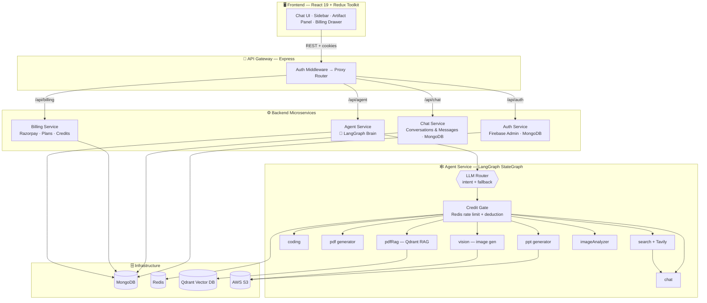

<div align="center">

<pre align="center">
 ██╗   ██╗  ██████╗  ██████╗  ████████╗ ███████╗ ██╗  ██╗
 ██║   ██║ ██╔═══██╗ ██╔══██╗ ╚══██╔══╝ ██╔════╝ ╚██╗██╔╝
 ██║   ██║ ██║   ██║ ██████╔╝    ██║    █████╗    ╚███╔╝ 
 ╚██╗ ██╔╝ ██║   ██║ ██╔══██╗    ██║    ██╔══╝    ██╔██╗ 
  ╚████╔╝  ╚██████╔╝ ██║  ██║    ██║    ███████╗ ██╔╝ ██╗
   ╚═══╝    ╚═════╝  ╚═╝  ╚═╝    ╚═╝    ╚══════╝ ╚═╝  ╚═╝
</pre>

**🌀 chat · 🔎 search · 💻 code · 📄 pdf · 📊 ppt · 🎨 vision — one brain, eight hands 🧠**

### *A Multi-Agent AI Platform That Thinks, Then Delegates*

**One prompt in. The right specialist agent out — automatically.**

[](https://nodejs.org/)
[](https://react.dev/)
[](https://www.langchain.com/langgraph)
[](https://www.mongodb.com/)
[](https://www.docker.com/)
[](#-license)

<br/>

**[Architecture](#-architecture) · [Agents](#-meet-the-agent-swarm) · [Quick Start](#-quick-start) · [Environment](#-environment-variables) · [API](#-api-surface) · [Roadmap](#-roadmap)**

</div>

<br/>

## 🧭 What Is Vortex?

**Vortex** is a production-shaped, microservice-based **multi-agent AI system**. Instead of pointing every request at one generic model, Vortex runs an **intelligent LLM router** in front of a swarm of purpose-built agents — a `coding` agent, a `search` agent, a document (`pdf` / `pdfRag`) agent, a slide-deck (`ppt`) agent, and vision agents (`vision` / `imageAnalyzer`) — and hands each request to whichever specialist is best equipped to answer it.

It's built the way an agentic product actually ships: a **gateway** at the edge, independent **services** behind it, a **stateful graph** orchestrating reasoning, **credits & billing** to meter usage, and a **React** front end to tie it all together.

> Think of Vortex less like a chatbot and more like a **dispatcher standing at the center of a control room**, reading every request and routing it down the correct hallway — coding, research, documents, design, or vision — while a ledger quietly tracks the cost of every trip.

<br/>

## ✨ Highlights

| | |
|---|---|
| 🧠 **LLM-Powered Router** | An intent-classification model reads the prompt *and* any attached file, reasons about it few-shot style, and returns a primary agent + fallback agent as structured JSON. |
| 🕸️ **Graph-Based Orchestration** | Built on **LangGraph's `StateGraph`** — every request flows through explicit nodes (`router → credit → <agent> → end`) instead of ad-hoc if/else spaghetti. |
| 🧩 **8 Specialist Agents** | Chat, Search, Coding, PDF generation, PDF/RAG Q&A, PPT generation, Image generation, and Image analysis — each with its own model, prompt strategy, and output pipeline. |
| 🔀 **Best Model for the Job** | Groq (`gpt-oss-120b`) for fast structured reasoning, Gemini for vision/multimodal, OpenRouter (`deepseek-chat`) for heavyweight coding — chosen per-agent, not one-size-fits-all. |
| 📚 **Retrieval-Augmented Documents** | Uploaded PDFs are chunked, embedded, and stored in **Qdrant**, so `pdfRag` answers questions grounded in the actual document. |
| 💳 **Credits, Plans & Rate Limits** | Every agent call debits a credit ledger; **Redis**-backed sliding-window limits cap abuse per agent, per user, per minute. |
| 💸 **Real Billing** | **Razorpay** checkout, order creation, and payment verification wired end-to-end for Free / Starter / Pro plans. |
| 🔐 **Firebase Auth Gateway** | Google-backed auth issues cookies validated by gateway middleware before any protected route is proxied downstream. |
| 🖼️ **Artifacts, Not Just Text** | Agents can hand back generated PDFs, PPTX decks, S3-hosted images, and code artifacts — rendered in a dedicated Artifact Panel on the frontend. |
| 😴 → 🌅 **Self-Waking Services** | The gateway pings every downstream service on boot and keeps them warm during activity — built for free-tier hosting that sleeps on idle. |

<br/>

## 🏗️ Architecture

Vortex is a **monorepo of independently deployable Node.js microservices**, fronted by one gateway and consumed by a single React SPA.



### Request lifecycle

1. **Frontend** sends a message (+ optional file) to `/api/agent` through the gateway, cookies attached.
2. **Gateway** validates the session (`protect` middleware) and proxies the request downstream with an identity header.
3. **Agent service** enters the graph at `router`, which either:
   - trusts an explicit `agent` field from the client, **or**
   - deterministically defaults on file-type alone (no LLM call needed), **or**
   - calls a small, fast LLM to classify intent from the prompt + file + recent history, returning `{ agent, fallback }` as JSON.
4. The graph moves to `credit`, which checks a **Redis** rate-limit window and deducts credits — insufficient credits or an exceeded limit short-circuits the whole request with a structured error.
5. Control passes to the chosen **specialist node** (`chat`, `search`, `coding`, `pdf`, `pdfRag`, `ppt`, `vision`, `imageAnalyzer`), which does its work and can hand off (e.g. `search → chat` to let the chat model narrate the fetched results).
6. The final state (`aiResponse`, `artifacts`, `images`, `searchResults`) flows back through the gateway to the UI.

<br/>

## 🐝 Meet the Agent Swarm

Each agent is a node in the graph with a single responsibility. The router's job is to never let a request reach the wrong one.

| Agent | Role | Model | Triggers on |
|---|---|---|---|
| 💬 `chat` | General conversation, writing, explanations, brainstorming, translation | Groq `gpt-oss-120b` | Everything that isn't a better fit elsewhere — the default agent |
| 🔎 `search` | Live web lookup — news, weather, prices, current events | Groq + **Tavily** search, then handed to `chat` to narrate | Anything requiring up-to-date, real-world information |
| 💻 `coding` | Programming, debugging, architecture, code generation | OpenRouter `deepseek-chat` (Gemini fallback) | Software, APIs, DevOps, technical interview questions |
| 📄 `pdf` | Generates a brand-new PDF from scratch or pasted text | Groq → `pdfkit` | "Create/export a PDF," turning notes into a document |
| 📚 `pdfRag` | Answers questions **about** an uploaded PDF, grounded in its content | Gemini embeddings + **Qdrant** retrieval | Reading, summarizing, or querying an attached PDF |
| 📊 `ppt` | Builds downloadable slide decks | Groq → `pptxgenjs` | "Make me a presentation / slides / deck" |
| 🎨 `vision` | Generates or edits images | Gemini | New image generation, style transfer, image-to-image edits |
| 🖼️ `imageAnalyzer` | Reads, describes, and OCRs uploaded images | Gemini | Visual Q&A on an attached image |

**The router's tie-break rule, in plain English:** *if a file is attached, the file decides the domain (PDF-family vs. image-family) — but the user's wording decides whether they want it read or a new one created.* An empty prompt with a file attached always defaults to the safer "read/analyze" agent rather than guessing at generation.

<br/>

## 📁 Project Structure

```
Vortex-Multi-Agent-Ai/
├── backend/
│   ├── docker-compose.yml         # Redis for local dev
│   ├── shared/redis/              # Shared Redis client
│   ├── gateway/                   # 🚪 Single entry point
│   │   ├── controller/            # /api/me
│   │   ├── middleware/            # Auth guard
│   │   └── utils/                 # Header-forwarding proxy, service warmup/keepalive
│   └── services/
│       ├── auth/                  # Firebase Admin + Mongo user records
│       ├── chat/                  # Conversations & message history
│       ├── billing/               # Razorpay orders, plans, verification
│       └── agent/                 # 🧠 The multi-agent brain
│           ├── graph/             # StateGraph definition, router, shared state
│           ├── agents/            # One file per specialist agent
│           ├── config/            # LLM clients, Qdrant, embeddings, S3, rate limits
│           └── utils/             # PDF/PPT generation, S3 I/O, credit deduction
└── frontend/
    ├── src/
    │   ├── pages/                 # Dashboard, Login
    │   ├── components/            # ChatArea, Sidebar, ArtifactPanel, BillingDrawer…
    │   ├── features/              # API calls (conversations, messages, payments)
    │   └── redux/                 # RTK slices: user, conversation, message
    └── utils/                     # Axios instance, Firebase client config
```

<br/>

## 🧰 Tech Stack

<table>
<tr>
<td valign="top" width="50%">

**Frontend**
- React 19 + Vite
- Redux Toolkit / React-Redux
- React Router 7
- Tailwind CSS 4
- Firebase (client auth)
- react-markdown + remark-gfm + syntax-highlighter
- Sandpack (`@codesandbox/sandpack-react`) for live code artifacts
- Motion (animations)

</td>
<td valign="top" width="50%">

**Backend**
- Node.js + Express 5 (all services)
- **LangGraph** (`StateGraph`) — agent orchestration
- **LangChain** integrations: Groq, Google Gemini, OpenRouter, Qdrant, Tavily, text-splitters
- MongoDB + Mongoose
- Redis (`ioredis`) — rate limiting & caching
- Firebase Admin — auth verification
- Razorpay — payments
- AWS S3 (`@aws-sdk`) — file & image storage
- `pdfkit`, `pdf-parse`, `pptxgenjs` — document generation

</td>
</tr>
</table>

<br/>

## 🚀 Quick Start

### Prerequisites

- **Node.js** ≥ 18
- **Docker** (for Redis) — or a Redis instance URL
- **MongoDB** connection string (Atlas or local)
- A **Qdrant** instance (cloud or self-hosted)
- **AWS S3** bucket (for file/image storage)
- API keys: **Groq**, **Google (Gemini)**, **OpenRouter**, **Tavily**, **Razorpay**, **Firebase**

### 1 — Clone & install

```bash
git clone https://github.com/<your-org>/Vortex-Multi-Agent-Ai.git
cd Vortex-Multi-Agent-Ai

# Install each service independently
cd backend/gateway            && npm install && cd ../..
cd backend/services/auth      && npm install && cd ../../..
cd backend/services/chat      && npm install && cd ../../..
cd backend/services/billing   && npm install && cd ../../..
cd backend/services/agent     && npm install && cd ../../..
cd frontend                   && npm install && cd ..
```

### 2 — Start infrastructure

```bash
cd backend
docker compose up -d          # spins up Redis on :6379
```

### 3 — Configure environment variables

Create a `.env` in **each** service directory — see [Environment Variables](#-environment-variables) below for the full reference.

### 4 — Run everything (each in its own terminal)

```bash
# Gateway
cd backend/gateway          && npm run dev

# Auth service
cd backend/services/auth    && npm run dev

# Chat service
cd backend/services/chat    && npm run dev

# Billing service
cd backend/services/billing && npm run dev

# Agent service — the multi-agent brain
cd backend/services/agent   && npm run dev

# Frontend
cd frontend                 && npm run dev
```

> 💡 **Tip:** Each backend service is a standalone Express app with its own `package.json`, `Dockerfile`, and lifecycle — deploy them independently (Render, Railway, Fly.io, ECS, etc.) and just point the gateway's `*_SERVICE_URL` variables at wherever they land.

<br/>

## 🔑 Environment Variables

### `backend/gateway/.env`

```env
PORT=5000
FRONTEND_URL=http://localhost:5173
AUTH_SERVICE_URL=http://localhost:5001
CHAT_SERVICE_URL=http://localhost:5002
AGENT_SERVICE_URL=http://localhost:5003
BILLING_SERVICE_URL=http://localhost:5004
```

### `backend/services/auth/.env`

```env
PORT=5001
MONGO_URI=mongodb+srv://...
FIREBASE_SERVICE_ACCOUNT_JSON={"type":"service_account", ...}
```

### `backend/services/chat/.env`

```env
PORT=5002
MONGO_URI=mongodb+srv://...
```

### `backend/services/billing/.env`

```env
PORT=5004
MONGO_URI=mongodb+srv://...
RAZORPAY_KEY_ID=rzp_test_xxxxxxxx
RAZORPAY_KEY_SECRET=xxxxxxxxxxxxxxxx
```

### `backend/services/agent/.env`  (the brain — needs the most)

```env
PORT=5003
NODE_ENV=development
MONGO_URI=mongodb+srv://...
REDIS_URL=redis://localhost:6379

# LLM providers
GROQ_API_KEY=gsk_xxxxxxxxxxxxxxxx
GOOGLE_API_KEY=AIzaSyxxxxxxxxxxxxxxxx
OPENROUTER_API_KEY=sk-or-xxxxxxxxxxxxxxxx

# Retrieval-Augmented Generation
QDRANT_URL=https://xxxxxxxx.qdrant.io

# Web search agent
TAVILY_API_KEY=tvly-xxxxxxxxxxxxxxxx

# File & image storage
AWS_ACCESS_KEY_ID=AKIAxxxxxxxxxxxxxxxx
AWS_SECRET_KEY=xxxxxxxxxxxxxxxx
AWS_REGION=ap-south-1
AWS_BUCKET_NAME=vortex-uploads
```

### `frontend/.env`

```env
VITE_SERVER_URL=http://localhost:5000
VITE_AUTH_SERVICE_URL=http://localhost:5000/api/auth
VITE_CHAT_SERVICE_URL=http://localhost:5000/api/chat
VITE_AGENT_SERVICE_URL=http://localhost:5000/api/agent
VITE_BILLING_SERVICE_URL=http://localhost:5000/api/billing

VITE_FIREBASE_API_KEY=xxxxxxxxxxxxxxxx
VITE_RAZORPAY_KEY_ID=rzp_test_xxxxxxxx
```

> ⚠️ **Never commit real `.env` files.** The values above are placeholders — rotate any key that's ever touched a public repo.

<br/>

## 💳 Credits & Plans

Every agent call costs credits, deducted by the `credit` node in the graph **before** the specialist agent runs — a failed generation never wastes a user's balance twice, and an empty balance short-circuits the request with a clear `INSUFFICIENT_CREDITS` error.

| Plan | Price / mo | Credits | 
|---|---|---|
| 🆓 Free | ₹0 | 100 |
| 🚀 Starter | ₹399 | 500 |
| 🏆 Pro | ₹999 | 1,200 |

On top of credits, a **Redis sliding-window rate limiter** caps how often each agent can be hit per user per minute — generous for `chat` (20/min), tighter for heavier agents like `search`, `coding`, `pdf`, `ppt`, `vision`, `pdfRag`, and `imageAnalyzer` (5/min each) — so no single user can monopolize the more expensive specialists.

<br/>

## 🌐 API Surface

All routes are served through the **gateway** and (except `/api/auth`) require an authenticated session cookie.

| Method | Route | Description |
|---|---|---|
| `*` | `/api/auth/*` | Login, signup, session handling (Firebase-backed) |
| `GET` | `/api/me` | Returns the currently authenticated user |
| `GET` | `/api/warmup` | Manually pings all downstream services awake |
| `*` | `/api/chat/*` | 🔒 Conversation & message CRUD |
| `*` | `/api/agent/*` | 🔒 Send a prompt (+ file) into the LangGraph agent pipeline |
| `*` | `/api/billing/*` | 🔒 Create Razorpay orders, verify payments, fetch plan status |

<br/>

## 🗺️ Roadmap

- [ ] Streaming token-by-token responses from the agent graph to the UI
- [ ] Multi-turn tool use inside the `coding` agent (sandboxed execution)
- [ ] Team / workspace support with shared credit pools
- [ ] Additional agents: spreadsheet generation, voice transcription
- [ ] Observability layer for router decisions (accuracy dashboard on `routerMeta`)

<br/>

## 🤝 Contributing

Contributions, issues, and feature requests are welcome — this is exactly the kind of project that benefits from more hands on more agents.

1. Fork the repo
2. Create a feature branch: `git checkout -b feat/new-agent`
3. Commit your changes: `git commit -m "feat: add <agent-name> agent"`
4. Push and open a Pull Request

<br/>

## 📜 License

Distributed under the **ISC License**. See individual service `package.json` files for details.

<br/>

<div align="center">

### Built with a swarm, not a monolith. 🌀
 
Made with too much coffee and one too many `console.log`s by **Anmol Yadav** ☕
 
*Star the repo if Vortex saved you from writing another giant if/else chain.*

</div>
